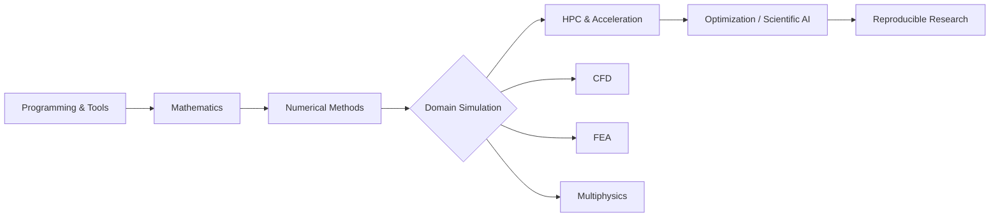

<a id="top"></a>

<picture>
  <source media="(prefers-color-scheme: dark)" srcset="assets/branding/banner-dark.svg">
  <source media="(prefers-color-scheme: light)" srcset="assets/branding/banner-light.svg">
  
</picture>

<div align="center">

### Learn the foundations. Build trusted simulations. Scale toward scientific AI.

[](#resource-library)
[](#learning-roadmap)
[](https://github.com/islam-md-didarul/computational-engineering-resource-hub/issues/new?template=resource-suggestion.yml)

[](https://github.com/islam-md-didarul/computational-engineering-resource-hub/actions/workflows/validate-resources.yml)
[](https://github.com/islam-md-didarul/computational-engineering-resource-hub/actions/workflows/link-check.yml)
[](LICENSE)
[](CONTRIBUTING.md)

</div>

> [!IMPORTANT]
> This is a **repository-first knowledge hub**. Everything is designed to work directly inside GitHub—no separate website, custom CSS or GitHub Pages deployment is required.

## At a glance

| **58 curated resources** | **10 technical domains** | **57 free/open resources** | **18 editor's picks** |
|:---:|:---:|:---:|:---:|
| Courses, books, documentation, tutorials and references | From programming foundations to scientific AI | Prioritizing accessible learning and official sources | Marked with ⭐ inside the library |

## Why this repository

| 🎯 **Structured, not overwhelming** | 🧪 **Engineering-focused** | ✅ **Quality-controlled** |
|---|---|---|
| Resources are arranged as a progression from foundations to advanced practice. | The collection emphasizes simulation, numerical modeling, HPC, optimization, and scientific AI. | Entries are stored in structured JSON and checked automatically for format and broken links. |

## Choose your learning track

| Track | Recommended sequence | Best for |
|---|---|---|
| **🧱 Foundations** | [Programming](#programming-tools) → [Mathematics](#mathematics) → [Numerical Methods](#numerical-methods) | Students beginning computational engineering |
| **🌊 Simulation & CFD** | [Physics](#physics-mechanics) → [Numerical Methods](#numerical-methods) → [CFD](#cfd-fluid-mechanics) → [HPC](#hpc-parallel-computing) | CFD analysts and fluid-mechanics researchers |
| **🏗️ Structures & Multiphysics** | [Mathematics](#mathematics) → [FEA](#fea-solid-mechanics) → [HPC](#hpc-parallel-computing) → [Optimization](#optimization-control) | Structural, solid-mechanics and multiphysics learners |
| **🧠 Scientific AI** | [Programming](#programming-tools) → [Numerical Methods](#numerical-methods) → [Data & ML](#data-ml-scientific-ai) → [Research Workflow](#research-workflow) | Researchers combining simulation with ML/ROM methods |

## Learning roadmap



| Stage | Build this capability | Evidence of progress |
|:---:|---|---|
| **01** | Scientific programming, shell, Git, plotting | A reproducible repository that reads data and produces a figure |
| **02** | Calculus, linear algebra, ODEs, probability | A notebook explaining and implementing one mathematical model |
| **03** | Discretization, solvers, stability, convergence | A verified diffusion, advection, Poisson or ODE solver |
| **04** | CFD, FEA, heat transfer, or multiphysics | Reproduction of a published benchmark with mesh/time-step evidence |
| **05** | Profiling, MPI/OpenMP/GPU, scalable solvers | A documented speedup or scaling study |
| **06** | Optimization, ROM, PINNs, operator learning | Comparison against a trusted numerical baseline |
| **07** | Data, code, documentation, citation, release | A citable and reproducible research package |

**Expanded guide:** [Computational Engineering Learning Roadmap](docs/learning-roadmap.md)

## Start with these editor's picks

| Area | Recommended starting point | Why it stands out |
|---|---|---|
| **Computing workflow** | [The Missing Semester of Your CS Education](https://missing.csail.mit.edu/) | Practical shell, Git, debugging, and automation skills often missing from engineering curricula |
| **Numerical computing** | [Python Programming and Numerical Methods](https://pythonnumericalmethods.studentorg.berkeley.edu/notebooks/Index.html) | Engineering-first examples with executable Python workflows |
| **Mathematical intuition** | [Essence of Linear Algebra](https://www.3blue1brown.com/topics/linear-algebra) | Strong visual understanding of matrices, eigenvectors and transformations |
| **CFD fundamentals** | [CFD Direct: Notes on CFD](https://doc.cfd.direct/notes/cfd-general-principles/) | Concise finite-volume and solver guidance from an authoritative source |
| **Turbulence modeling** | [NASA Turbulence Modeling Resource](https://turbmodels.larc.nasa.gov/) | Verified model equations, implementation details and benchmark cases |
| **Scientific AI** | [Physics-based Deep Learning](https://physicsbaseddeeplearning.org/) | Connects numerical simulation, differentiable physics and modern learning methods |
| **Reproducible research** | [The Turing Way](https://book.the-turing-way.org/) | A practical handbook for reliable, ethical and collaborative research |

## Explore by category

| Category | Resources | Scope |
|---|:---:|---|
| 🧰 **[Programming & Tools](#programming-tools)** | **8** | Scientific programming, Git, Linux, debugging, and reproducible developer workflows. |
| 🔢 **[Numerical Methods](#numerical-methods)** | **4** | Algorithms for equations, ODEs, PDEs, integration, interpolation, and error analysis. |
| 📐 **[Mathematics](#mathematics)** | **6** | Calculus, linear algebra, differential equations, probability, and mathematical foundations. |
| ⚙️ **[Physics & Mechanics](#physics-mechanics)** | **4** | Fluid dynamics, thermodynamics, statics, dynamics, and continuum mechanics. |
| 🌊 **[CFD & Fluid Mechanics](#cfd-fluid-mechanics)** | **7** | Finite-volume methods, solvers, meshing, turbulence modeling, and verification. |
| 🏗️ **[FEA & Solid Mechanics](#fea-solid-mechanics)** | **4** | Finite-element theory, structural simulation, open-source frameworks, and examples. |
| 🚀 **[HPC & Parallel Computing](#hpc-parallel-computing)** | **6** | MPI, OpenMP, GPU programming, performance engineering, and scalable solvers. |
| 🧠 **[Data, ML & Scientific AI](#data-ml-scientific-ai)** | **8** | Scientific Python, machine learning, PINNs, operator learning, and reduced-order models. |
| 🎯 **[Optimization & Control](#optimization-control)** | **6** | Design optimization, adjoints, convex methods, system dynamics, and control. |
| 🔬 **[Research Workflow](#research-workflow)** | **5** | Reproducibility, technical writing, data management, citation, and collaboration. |


## Resource library

> [!TIP]
> Expand only the categories you need. **⭐** marks a recommended starting point, while `tags` help you quickly identify the main focus of each resource.

<!-- RESOURCE_LIBRARY_START -->

<a id="programming-tools"></a>
<details>
<summary><strong>🧰 Programming & Tools</strong> &nbsp;·&nbsp; 8 resources &nbsp;·&nbsp; 7 beginner / 1 intermediate / 0 advanced</summary>

> Scientific programming, Git, Linux, debugging, and reproducible developer workflows.

| Resource | Focus | Level | Format | Access |
|---|---|:---:|:---:|:---:|
| **[The Missing Semester of Your CS Education](https://missing.csail.mit.edu/)** ⭐<br><sub>Practical command-line, shell, Git, editor, debugging, and automation skills that engineering courses often assume.</sub> | `shell` · `git` · `debugging` · `automation` | **Beginner** | Course | ✅ Free |
| **[Learn Git Branching](https://learngitbranching.js.org/)**<br><sub>A visual, browser-based way to practice commits, branches, merging, rebasing, and remote workflows.</sub> | `git` · `version-control` | **Beginner** | Interactive | ✅ Free |
| **[Pro Git](https://git-scm.com/book/en/v2)**<br><sub>The comprehensive reference for Git concepts, collaboration patterns, internals, and advanced workflows.</sub> | `git` · `collaboration` · `reference` | **Intermediate** | Book | ✅ Free |
| **[Official Python Tutorial](https://docs.python.org/3/tutorial/)**<br><sub>A direct introduction to Python syntax, data structures, modules, classes, errors, and standard-library fundamentals.</sub> | `python` · `programming` | **Beginner** | Documentation | ✅ Free |
| **[LearnCpp](https://www.learncpp.com/)**<br><sub>A structured path through modern C++ for students preparing for simulation software and high-performance computing.</sub> | `cpp` · `programming` | **Beginner** | Tutorial | ✅ Free |
| **[MATLAB Onramp](https://matlabacademy.mathworks.com/details/matlab-onramp/gettingstarted)**<br><sub>A short interactive introduction to MATLAB arrays, scripts, plotting, data import, and basic programming.</sub> | `matlab` · `data-analysis` | **Beginner** | Interactive | ✅ Free |
| **[Visual Studio Code Documentation](https://code.visualstudio.com/docs)**<br><sub>Setup and workflow guidance for editing, debugging, remote development, notebooks, terminals, and extensions.</sub> | `ide` · `debugging` · `remote-development` | **Beginner** | Documentation | ✅ Free |
| **[Project Jupyter](https://jupyter.org/try)**<br><sub>Try notebook-based scientific computing in the browser and learn reproducible computational narratives.</sub> | `jupyter` · `notebooks` · `reproducibility` | **Beginner** | Interactive | ✅ Free |

</details>

<a id="numerical-methods"></a>
<details>
<summary><strong>🔢 Numerical Methods</strong> &nbsp;·&nbsp; 4 resources &nbsp;·&nbsp; 1 beginner / 2 intermediate / 1 advanced</summary>

> Algorithms for equations, ODEs, PDEs, integration, interpolation and error analysis.

| Resource | Focus | Level | Format | Access |
|---|---|:---:|:---:|:---:|
| **[Python Programming and Numerical Methods](https://pythonnumericalmethods.studentorg.berkeley.edu/notebooks/Index.html)** ⭐<br><sub>Engineering-oriented Python examples covering numerical differentiation, integration, roots, linear algebra, and differential equations.</sub> | `python` · `numerical-methods` · `engineering` | **Beginner** | Book | ✅ Free |
| **[Fundamentals of Numerical Computation](https://fncbook.com/)** ⭐<br><sub>An open text combining numerical analysis, computational experiments, and implementations in multiple languages.</sub> | `numerical-analysis` · `linear-algebra` · `ode` · `pde` | **Intermediate** | Book | ✅ Free |
| **[Numerical Recipes Code Resources](https://numerical.recipes/)**<br><sub>A broad map of classical numerical algorithms and implementation patterns for scientific applications.</sub> | `algorithms` · `reference` · `scientific-computing` | **Advanced** | Reference | ◐ Mixed |
| **[SciPy Lecture Notes](https://scipy-lectures.org/)**<br><sub>A practical scientific Python curriculum using NumPy, SciPy, Matplotlib, image processing, and optimization.</sub> | `python` · `numpy` · `scipy` · `visualization` | **Intermediate** | Course | ✅ Free |

</details>

<a id="mathematics"></a>
<details>
<summary><strong>📐 Mathematics</strong> &nbsp;·&nbsp; 6 resources &nbsp;·&nbsp; 4 beginner / 2 intermediate / 0 advanced</summary>

> Calculus, linear algebra, differential equations, probability, and mathematical foundations.

| Resource | Focus | Level | Format | Access |
|---|---|:---:|:---:|:---:|
| **[Essence of Calculus](https://www.3blue1brown.com/topics/calculus)** ⭐<br><sub>Visual intuition for derivatives, integrals, limits, Taylor series, and the fundamental theorem of calculus.</sub> | `calculus` · `visual-learning` | **Beginner** | Video Series | ✅ Free |
| **[Essence of Linear Algebra](https://www.3blue1brown.com/topics/linear-algebra)** ⭐<br><sub>A geometric introduction to vectors, matrices, determinants, eigenvectors, and changes of basis.</sub> | `linear-algebra` · `visual-learning` | **Beginner** | Video Series | ✅ Free |
| **[MIT 18.06 Linear Algebra](https://ocw.mit.edu/courses/18-06-linear-algebra-spring-2010/)**<br><sub>Gilbert Strang's complete course on vector spaces, factorization, least squares, eigenvalues, and applications.</sub> | `linear-algebra` · `matrix-factorization` · `least-squares` | **Intermediate** | Course | ✅ Free |
| **[Book of Proof](https://www.people.vcu.edu/~rhammack/BookOfProof/)**<br><sub>A freely available introduction to logic, sets, relations, functions, induction, and proof techniques.</sub> | `logic` · `proofs` · `discrete-math` | **Beginner** | Book | ✅ Free |
| **[Seeing Theory](https://seeing-theory.brown.edu/)**<br><sub>Interactive visual explanations of probability, distributions, inference, regression, and Bayesian ideas.</sub> | `probability` · `statistics` · `interactive` | **Beginner** | Interactive | ✅ Free |
| **[MIT Differential Equations](https://ocw.mit.edu/courses/18-03sc-differential-equations-fall-2011/)**<br><sub>A full course on ordinary differential equations, linear systems, Fourier methods, and modeling.</sub> | `ode` · `fourier` · `dynamical-systems` | **Intermediate** | Course | ✅ Free |

</details>

<a id="physics-mechanics"></a>
<details>
<summary><strong>⚙️ Physics & Mechanics</strong> &nbsp;·&nbsp; 4 resources &nbsp;·&nbsp; 2 beginner / 2 intermediate / 0 advanced</summary>

> Fluid dynamics, thermodynamics, statics, dynamics, and continuum mechanics.

| Resource | Focus | Level | Format | Access |
|---|---|:---:|:---:|:---:|
| **[MIT Fluid Dynamics](https://ocw.mit.edu/courses/2-06-fluid-dynamics-spring-2013/)** ⭐<br><sub>Core fluid dynamics topics including conservation laws, dimensional analysis, viscous flow, boundary layers, and waves.</sub> | `fluid-mechanics` · `conservation-laws` · `boundary-layers` | **Intermediate** | Course | ✅ Free |
| **[MIT Thermodynamics](https://ocw.mit.edu/courses/2-05-thermodynamics-fall-2013/)**<br><sub>Engineering thermodynamics with property relations, cycles, entropy, equilibrium, and energy conversion.</sub> | `thermodynamics` · `energy` · `entropy` | **Intermediate** | Course | ✅ Free |
| **[Engineering Statics](https://engineeringstatics.org/)**<br><sub>An open mechanics text covering force systems, equilibrium, structures, friction, and centroids.</sub> | `statics` · `mechanics` · `structures` | **Beginner** | Book | ✅ Free |
| **[The Efficient Engineer: Stress and Strain](https://www.youtube.com/watch?v=KzZjcqj53o8)**<br><sub>A concise visual introduction to normal and shear stress, strain, constitutive behavior, and deformation.</sub> | `solid-mechanics` · `stress` · `strain` | **Beginner** | Video | ✅ Free |

</details>

<a id="cfd-fluid-mechanics"></a>
<details>
<summary><strong>🌊 CFD & Fluid Mechanics</strong> &nbsp;·&nbsp; 7 resources &nbsp;·&nbsp; 1 beginner / 4 intermediate / 2 advanced</summary>

> Finite-volume methods, solvers, meshing, turbulence modeling, and verification.

| Resource | Focus | Level | Format | Access |
|---|---|:---:|:---:|:---:|
| **[CFD Direct: Notes on CFD](https://doc.cfd.direct/notes/cfd-general-principles/)** ⭐<br><sub>A compact treatment of finite-volume discretization, transport equations, solution algorithms, and practical CFD principles.</sub> | `cfd` · `finite-volume` · `discretization` | **Intermediate** | Notes | ✅ Free |
| **[OpenFOAM Documentation](https://doc.openfoam.com/)** ⭐<br><sub>User guides, solver references, models, boundary conditions, meshing workflows, and tutorials for OpenFOAM.</sub> | `openfoam` · `cfd` · `meshing` | **Intermediate** | Documentation | ✅ Free |
| **[SU2 Documentation](https://su2code.github.io/docs/)**<br><sub>Documentation and tutorials for open-source multiphysics simulation, CFD, adjoint methods, and design optimization.</sub> | `su2` · `cfd` · `adjoint` · `optimization` | **Intermediate** | Documentation | ✅ Free |
| **[NASA Turbulence Modeling Resource](https://turbmodels.larc.nasa.gov/)** ⭐<br><sub>Verified equations, implementation notes, and benchmark cases for widely used RANS turbulence models.</sub> | `turbulence` · `rans` · `verification` | **Advanced** | Reference | ✅ Free |
| **[Gmsh Reference Manual](https://gmsh.info/doc/texinfo/gmsh.html)**<br><sub>Geometry, mesh generation, scripting, field control, and API documentation for the Gmsh mesher.</sub> | `meshing` · `gmsh` · `geometry` | **Intermediate** | Documentation | ✅ Free |
| **[ParaView Tutorials](https://docs.paraview.org/en/latest/Tutorials/index.html)**<br><sub>Guided post-processing workflows for filters, slices, streamlines, plots, animation, and parallel visualization.</sub> | `paraview` · `post-processing` · `visualization` | **Beginner** | Tutorial | ✅ Free |
| **[PyFR Documentation](https://pyfr.readthedocs.io/en/latest/)**<br><sub>High-order flux-reconstruction CFD workflows designed for modern CPUs, GPUs, and heterogeneous systems.</sub> | `high-order` · `gpu` · `cfd` | **Advanced** | Documentation | ✅ Free |

</details>

<a id="fea-solid-mechanics"></a>
<details>
<summary><strong>🏗️ FEA & Solid Mechanics</strong> &nbsp;·&nbsp; 4 resources &nbsp;·&nbsp; 0 beginner / 2 intermediate / 2 advanced</summary>

> Finite-element theory, structural simulation, open-source frameworks, and examples.

| Resource | Focus | Level | Format | Access |
|---|---|:---:|:---:|:---:|
| **[FEniCSx Tutorial](https://jsdokken.com/dolfinx-tutorial/)** ⭐<br><sub>Hands-on finite-element examples using DOLFINx, UFL, meshes, boundary conditions, solvers, and parallel execution.</sub> | `fenicsx` · `finite-element` · `pde` | **Intermediate** | Tutorial | ✅ Free |
| **[deal.II Tutorial Programs](https://www.dealii.org/current/doxygen/deal.II/Tutorial.html)**<br><sub>Progressive C++ examples for finite-element discretization, adaptivity, multiphysics, and scalable solvers.</sub> | `dealii` · `cpp` · `finite-element` · `adaptivity` | **Advanced** | Tutorial | ✅ Free |
| **[MFEM Examples](https://mfem.org/examples/)**<br><sub>Compact examples of high-order finite-element methods, parallel meshes, solvers, and multiphysics applications.</sub> | `mfem` · `finite-element` · `high-order` · `parallel` | **Advanced** | Examples | ✅ Free |
| **[SfePy Documentation](https://sfepy.org/doc-devel/index.html)**<br><sub>Python-based finite-element modeling for coupled PDEs, materials, boundary conditions, and custom weak forms.</sub> | `python` · `finite-element` · `multiphysics` | **Intermediate** | Documentation | ✅ Free |

</details>

<a id="hpc-parallel-computing"></a>
<details>
<summary><strong>🚀 HPC & Parallel Computing</strong> &nbsp;·&nbsp; 6 resources &nbsp;·&nbsp; 0 beginner / 3 intermediate / 3 advanced</summary>

> MPI, OpenMP, GPU programming, performance engineering, and scalable solvers.

| Resource | Focus | Level | Format | Access |
|---|---|:---:|:---:|:---:|
| **[LLNL HPC Tutorials](https://hpc-tutorials.llnl.gov/)** ⭐<br><sub>Practical tutorials on MPI, OpenMP, pthreads, GPU programming, performance analysis, and parallel design.</sub> | `hpc` · `mpi` · `openmp` · `gpu` | **Intermediate** | Course | ✅ Free |
| **[MPI Tutorial](https://mpitutorial.com/tutorials/)**<br><sub>An approachable sequence covering point-to-point communication, collectives, groups, communicators, and examples.</sub> | `mpi` · `distributed-computing` | **Intermediate** | Tutorial | ✅ Free |
| **[OpenMP Tutorials and Articles](https://www.openmp.org/resources/tutorials-articles/)**<br><sub>Official learning resources for shared-memory parallelism, directives, tasks, offloading, and performance.</sub> | `openmp` · `shared-memory` · `parallel` | **Intermediate** | Tutorial | ✅ Free |
| **[CUDA C++ Programming Guide](https://docs.nvidia.com/cuda/cuda-c-programming-guide/)**<br><sub>The core reference for CUDA execution, memory models, kernels, synchronization, optimization, and GPU features.</sub> | `cuda` · `gpu` · `cpp` | **Advanced** | Documentation | ✅ Free |
| **[PETSc Documentation](https://petsc.org/release/)** ⭐<br><sub>Scalable linear and nonlinear solvers, time integrators, optimization tools, and preconditioners for PDE applications.</sub> | `petsc` · `linear-solvers` · `nonlinear-solvers` · `mpi` | **Advanced** | Documentation | ✅ Free |
| **[Kokkos Core Documentation](https://kokkos.org/kokkos-core-wiki/)**<br><sub>Performance-portable C++ abstractions for parallel execution and memory across CPUs and GPUs.</sub> | `kokkos` · `performance-portability` · `cpp` | **Advanced** | Documentation | ✅ Free |

</details>

<a id="data-ml-scientific-ai"></a>
<details>
<summary><strong>🧠 Data, ML & Scientific AI</strong> &nbsp;·&nbsp; 8 resources &nbsp;·&nbsp; 1 beginner / 3 intermediate / 4 advanced</summary>

> Scientific Python, machine learning, PINNs, operator learning, and reduced-order models.

| Resource | Focus | Level | Format | Access |
|---|---|:---:|:---:|:---:|
| **[NumPy Learning Resources](https://numpy.org/learn/)**<br><sub>Curated paths for array computing, vectorization, broadcasting, linear algebra, and scientific Python workflows.</sub> | `numpy` · `python` · `arrays` | **Beginner** | Tutorial | ✅ Free |
| **[PyTorch Tutorials](https://docs.pytorch.org/tutorials/)** ⭐<br><sub>Official tutorials for tensors, neural networks, data pipelines, training, deployment, and distributed learning.</sub> | `pytorch` · `deep-learning` · `python` | **Intermediate** | Tutorial | ✅ Free |
| **[JAX Quickstart](https://docs.jax.dev/en/latest/notebooks/quickstart.html)**<br><sub>A compact introduction to accelerated NumPy-style computing, automatic differentiation, JIT compilation, and vectorization.</sub> | `jax` · `autodiff` · `gpu` · `scientific-ml` | **Intermediate** | Tutorial | ✅ Free |
| **[Physics-based Deep Learning](https://physicsbaseddeeplearning.org/)** ⭐<br><sub>A broad guide to combining numerical simulation, differentiable physics, surrogate modeling, and deep learning.</sub> | `scientific-ml` · `differentiable-physics` · `surrogates` | **Advanced** | Book | ✅ Free |
| **[NeuralOperator Documentation](https://neuraloperator.github.io/dev/)**<br><sub>Implementations and guides for Fourier neural operators and related operator-learning architectures.</sub> | `neural-operators` · `fno` · `surrogate-modeling` | **Advanced** | Documentation | ✅ Free |
| **[DeepXDE Documentation](https://deepxde.readthedocs.io/)**<br><sub>Physics-informed and operator-learning workflows for differential equations, inverse problems, and uncertainty.</sub> | `pinn` · `inverse-problems` · `deep-learning` | **Advanced** | Documentation | ✅ Free |
| **[Data-Driven Science and Engineering](https://www.databookuw.com/)** ⭐<br><sub>Resources on singular value decomposition, sparse modeling, dynamic mode decomposition, Koopman analysis, and control.</sub> | `dmd` · `koopman` · `rom` · `system-identification` | **Advanced** | Book | ✅ Free |
| **[CS229 Machine Learning Lectures](https://www.youtube.com/playlist?list=PLoROMvodv4rMiGQp3WXShtMGgzqpfVfbU)**<br><sub>A rigorous introduction to supervised learning, probabilistic models, kernels, neural networks, and learning theory.</sub> | `machine-learning` · `probability` · `optimization` | **Intermediate** | Video Series | ✅ Free |

</details>

<a id="optimization-control"></a>
<details>
<summary><strong>🎯 Optimization & Control</strong> &nbsp;·&nbsp; 6 resources &nbsp;·&nbsp; 0 beginner / 2 intermediate / 4 advanced</summary>

> Design optimization, adjoints, convex methods, system dynamics, and control.

| Resource | Focus | Level | Format | Access |
|---|---|:---:|:---:|:---:|
| **[Algorithms for Optimization](https://algorithmsbook.com/optimization/)** ⭐<br><sub>A readable introduction to derivative-based, derivative-free, stochastic, and constrained optimization methods.</sub> | `optimization` · `algorithms` · `engineering-design` | **Intermediate** | Book | ✅ Free |
| **[Convex Optimization](https://web.stanford.edu/~boyd/cvxbook/)**<br><sub>The standard open reference for convex sets, duality, optimality, numerical methods, and engineering applications.</sub> | `convex-optimization` · `duality` · `optimal-control` | **Advanced** | Book | ✅ Free |
| **[OpenMDAO Documentation](https://openmdao.org/newdocs/versions/latest/main.html)** ⭐<br><sub>A framework for multidisciplinary analysis and optimization with derivatives, coupled systems, and scalable workflows.</sub> | `mdao` · `design-optimization` · `multidisciplinary` | **Advanced** | Documentation | ✅ Free |
| **[CasADi Documentation](https://web.casadi.org/docs/)**<br><sub>Symbolic-numeric tools for automatic differentiation, nonlinear optimization, and optimal control.</sub> | `casadi` · `optimal-control` · `autodiff` | **Advanced** | Documentation | ✅ Free |
| **[Underactuated Robotics](https://underactuated.csail.mit.edu/)**<br><sub>Nonlinear dynamics, planning, estimation, and control through robotics examples and computational exercises.</sub> | `control` · `robotics` · `dynamics` · `planning` | **Advanced** | Course | ✅ Free |
| **[Python Control Systems Library](https://python-control.readthedocs.io/)**<br><sub>Python tools for state-space models, transfer functions, frequency response, stability, estimation, and design.</sub> | `control` · `python` · `state-space` | **Intermediate** | Documentation | ✅ Free |

</details>

<a id="research-workflow"></a>
<details>
<summary><strong>🔬 Research Workflow</strong> &nbsp;·&nbsp; 5 resources &nbsp;·&nbsp; 5 beginner / 0 intermediate / 0 advanced</summary>

> Reproducibility, technical writing, data management, citation, and collaboration.

| Resource | Focus | Level | Format | Access |
|---|---|:---:|:---:|:---:|
| **[The Turing Way](https://book.the-turing-way.org/)** ⭐<br><sub>A community handbook for reproducible, ethical, collaborative, and inclusive data-intensive research.</sub> | `reproducibility` · `open-science` · `collaboration` | **Beginner** | Handbook | ✅ Free |
| **[Software Carpentry Lessons](https://software-carpentry.org/lessons/)**<br><sub>Foundational lessons in shell use, version control, Python or R, and research-oriented data workflows.</sub> | `research-computing` · `git` · `shell` · `python` | **Beginner** | Course | ✅ Free |
| **[Overleaf Learn](https://www.overleaf.com/learn)**<br><sub>Practical guidance for LaTeX documents, equations, references, figures, tables, and collaborative writing.</sub> | `latex` · `academic-writing` · `collaboration` | **Beginner** | Documentation | ✅ Free |
| **[Zotero Documentation](https://www.zotero.org/support/)**<br><sub>Reference-management workflows for collecting papers, organizing libraries, annotating PDFs, and generating citations.</sub> | `references` · `citations` · `literature-review` | **Beginner** | Documentation | ✅ Free |
| **[GitHub Skills](https://skills.github.com/)**<br><sub>Short hands-on courses for repositories, pull requests, Actions, Pages, Markdown, and collaborative development.</sub> | `github` · `collaboration` · `ci-cd` | **Beginner** | Interactive | ✅ Free |

</details>
<!-- RESOURCE_LIBRARY_END -->

## Curation framework

A resource is considered for inclusion when it is:

| Criterion | What we look for |
|---|---|
| **Authoritative** | Official documentation, university courses, open textbooks, or primary educational sources |
| **Technically useful** | Clear relevance to computational engineering practice or theory |
| **Accessible** | Legal access, stable URLs, and minimal barriers to learning |
| **Well maintained** | Current content or enduring foundational value |
| **Actionable** | Tutorials, examples, exercises, documentation, or reproducible workflows |

Read the complete criteria in [Resource Guidelines](docs/resource-guidelines.md).

## Contributing

Contributions are welcome through either a structured issue or a pull request.

1. Review the [resource guidelines](docs/resource-guidelines.md).
2. Check that the resource is not already listed.
3. Add the entry to [`data/resources.json`](data/resources.json).
4. Run the validator and README generator.
5. Submit a pull request with a concise reason for inclusion.

```bash
python scripts/validate_resources.py
python scripts/generate_readme.py
```

[](https://github.com/islam-md-didarul/computational-engineering-resource-hub/issues/new?template=resource-suggestion.yml)
[](CONTRIBUTING.md)

## Maintenance

- `validate-resources.yml` checks the structured dataset whenever relevant files change.
- `link-check.yml` checks external links on a schedule and after repository updates.
- `scripts/generate_readme.py` keeps the visible library synchronized with `data/resources.json`.
- Broken, duplicated, outdated, or misleading resources can be reported through GitHub Issues.

## Citation

Citation metadata is provided in [`CITATION.cff`](CITATION.cff). GitHub can use this file to display a **Cite this repository** option.

## License

Repository code and original documentation are released under the [MIT License](LICENSE). Linked resources remain subject to their respective owners' licenses and terms.

---

<div align="center">

**Built for students, engineers, and researchers who want a reliable path from equations to validated computation.**

[Back to top](#top) · [Browse resources](#resource-library) · [Contribute](CONTRIBUTING.md)

</div>
